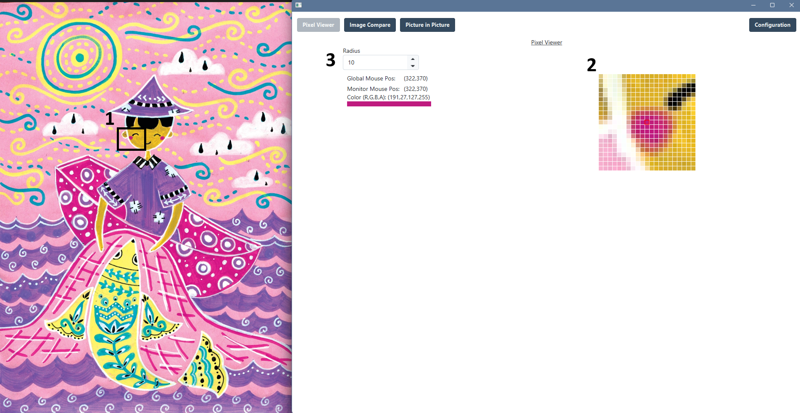
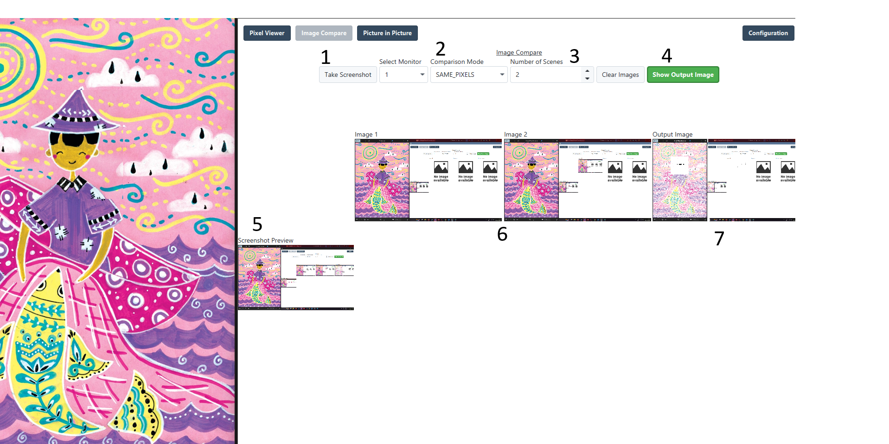
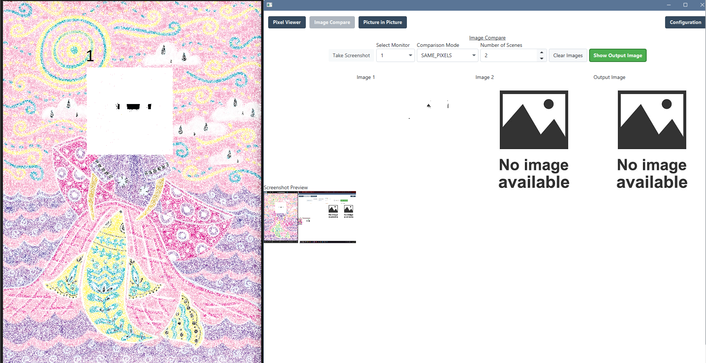
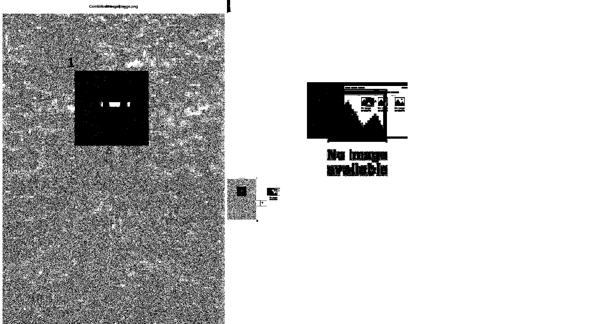
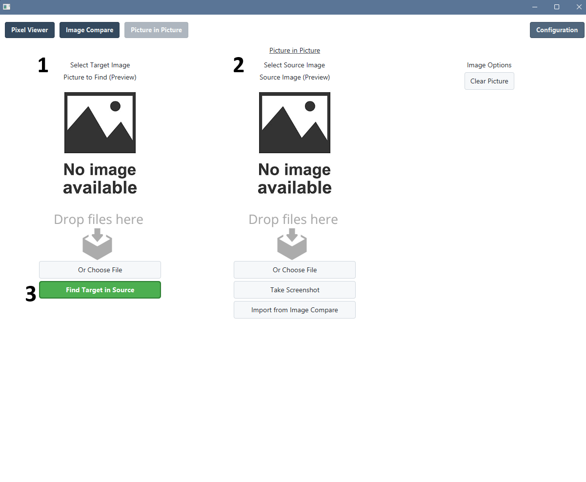
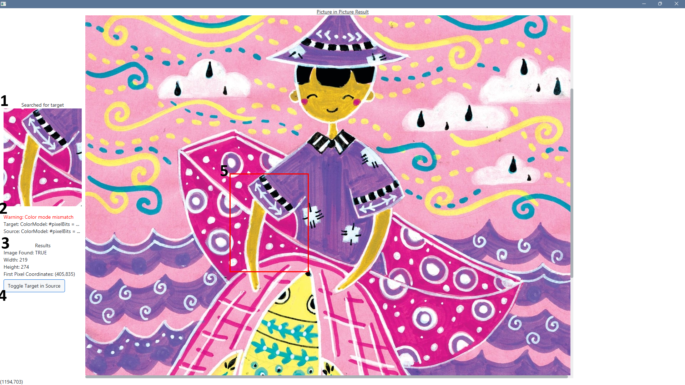

# Pixel Monitor

[](https://github.com/William-AU/PixelMonitor/releases)
[](https://www.linkedin.com/in/william-fledelius-3244a628a/)

### Table of Contents
1. [About the Project](#about-the-project)
2. [Requirements](#requirements)
3. [Installation](#installation)
4. [Features](#features)
   1. [Pixel Viewer](#pixel-viewer)
   2. [Image Compare](#image-compare)
   3. [Picture in Picture](#picture-in-picture)
5. [License](#license)

## About the Project
Pixel Monitor is a simple JavaFX/Spring Boot project to help with pixel based optimisation and analysis. The project aims
to tackle a few core pain points related to working with pixel based automation:
* Accurately and consistently locating the right pixels
* Finding "static" pixels across multiple images
* Finding specific images in larger images

For a full list of features and reasoning see [Features](#features).

## Requirements
Local Java installation supporting Java version 24 or newer.

## Installation
This project is developed and tested for Windows 11, but efforts have been made to ensure compatibility with other 
operating systems, but they are otherwise not explicitly supported.

To install PixelMonitor, ensure the [requirements](#requirements) are met, then download the latest [release](https://github.com/William-AU/PixelMonitor/releases). 
Alternatively, compile it from source using
```
gradle clean bootJar
```
The application can then be run using
```
java -jar PixelMonitor-X.Y.Z.jar
```

## Features
Pixel Monitor is built of multiple loosely connected tools. This section will give an in depth explanation of the 
functionality of each tool.

### Pixel Viewer
The Pixel Viewer tool allows for easy selection of selection of pixels, getting both their coordinates and color information.
Below is an example of a use case for the Pixel Viewer tool.

1. The approximate location of the mouse (Square drawn in post)
2. A grid showing the surrounding pixels, as well as the exact pixel being hovered
3. The radius of the pixel grid in (2), as well as exact information about the pixel coordinate and color data

### Image Compare
The Image Compare tool aims to assist in identifying "static pixels" between different images. This is useful when using
pixel locations to determine which scene a program is currently showing, among other things.

Below is the main Image Compare screen

1. `Take Screenshot` button: Takes a screenshot of the selected monitor. Here shown with only a single monitor.
2. `Comparison mode`: There are two comparison mods, each doing a pixel-by-pixel comparison of the images. The modes are:
   1. `SAME_PIXELS`: The resulting image shows only pixels that are identical in *all* of the images. See [same pixels example](#same-pixels-example)
   2. `UNIQUE_PIXELS`: The resulting image shows pixels which only appear in *one* of the images, these pixels are colored black. See [unique pixels example](#unique-pixels-example)
3. `Number of Scenes`: The number of images to compare, they are called `scenes` as the main purpose of the tool is to 
identify different scenes in a program.
4. `Show Output Image` button: Shows a full screen view of the output image, as shown in the [same pixels example](#same-pixels-example) and [unique pixels example](#unique-pixels-example)
5. `Screenshot Preview`: Shows what the `Take Screenshot` button will screenshot, useful for determining which monitor has which index
6. `Image Preview`: A preview of the taken screenshots
7. `Output Image`: A preview of the output image


#### Same Pixels Example
Example of comparison mode `SAME_PIXELS`

The two images used in the Image Comparison example look identical at first, but looking at (1), it now becomes clear
that one of the images was tampered with. It is seen that all the white pixels are pixels which are different between the to images.

#### Unique Pixels Example
Example of comparison mode `UNIQUE_PIXELS`

This example uses the same images as the Image Compare example and `SAME_PIXELS` example, and gives much the same information.
When only two images are selected, this mode effectively functions as a black-and-white contrast of the `SAME_PIXELS` mode.

### Picture in Picture
The Picture in Picture tool aims to find a given `target picture` within a `source picture` as seen below.

1. `Target Image`: The target image to find in the source image, this can be uploaded directly through drag-and-drop, or selected using the OS specific file chooser.
2. `Source Image`: The image to find the target image in, this is chosen in the same way as the target image, but can also be imported directly from the [Image Compare](#image-compare) tool.
3. `Find Target in Source`: Begins the image search and shows a full screen result of the image search as seen below


1. `Target Image`: Shows the target image that is being searched for.
2. `Color mode mismatch warning`: Warning text showing if the target and source image have different color modes. Having different color modes may lead to more false negatives.
3. `Result information`: Showing the status of the search, as well as information about the pixel coordinates (relative to the source image) of the target image.
4. `Toggle Target in Scene` button: Toggles the target finder in (5)
5. `Target Finder Rectangle`: Shows an outline around the target image in the source image, to help identify exactly where the target image is located.

## License
[LGPL3](https://choosealicense.com/licenses/lgpl-3.0/)